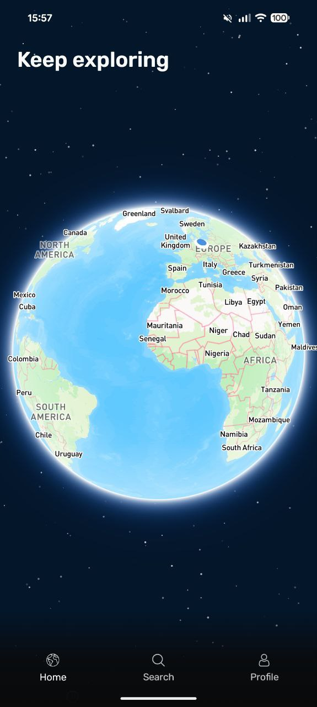
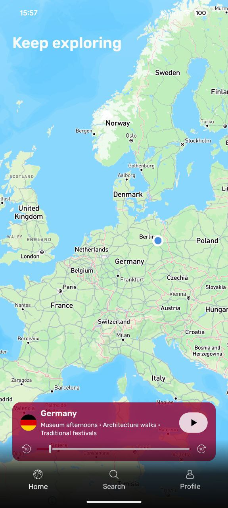
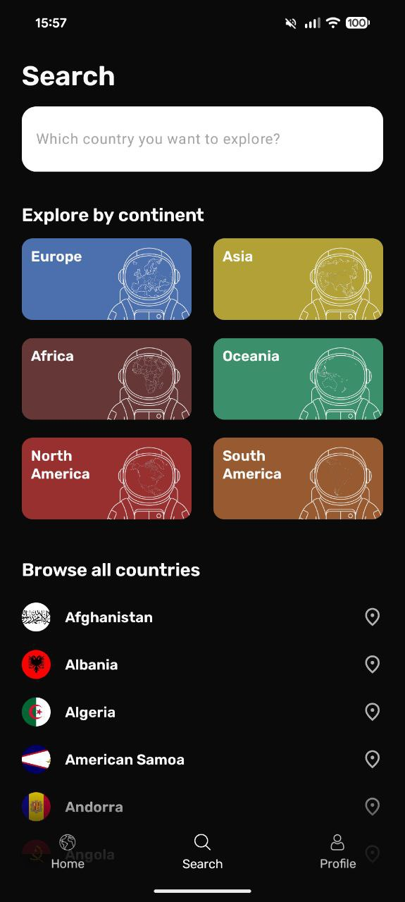
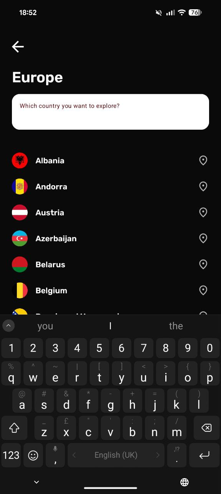
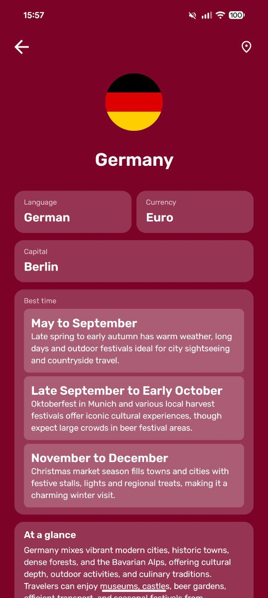
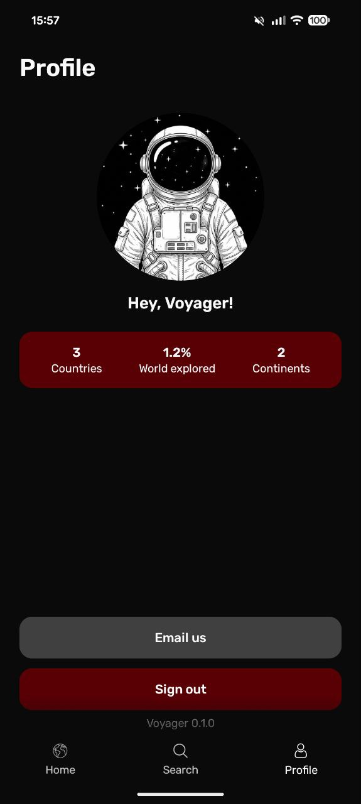

  

  # 🚀 Voyager

  **Your ultimate travel companion**

  Explore the world, discover countries, and track your global adventures — all in one beautiful app.

---

## ✨ Features

- 🌍 **Interactive Globe** — Explore the world with a stunning 3D earth visualization
- 🔍 **Smart Search** — Find countries by name or browse by continent
- 📊 **Travel Stats** — Track your exploration progress and visited countries
- 🗺️ **Detailed Insights** — Learn about languages, currencies, capitals, and best times to visit

## 📱 Screenshots

  
  
  
  
  
  

  Made with ❤️ using Kotlin Multiplatform

